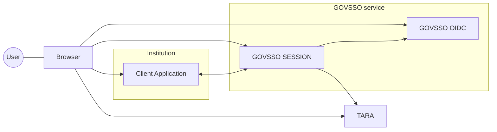
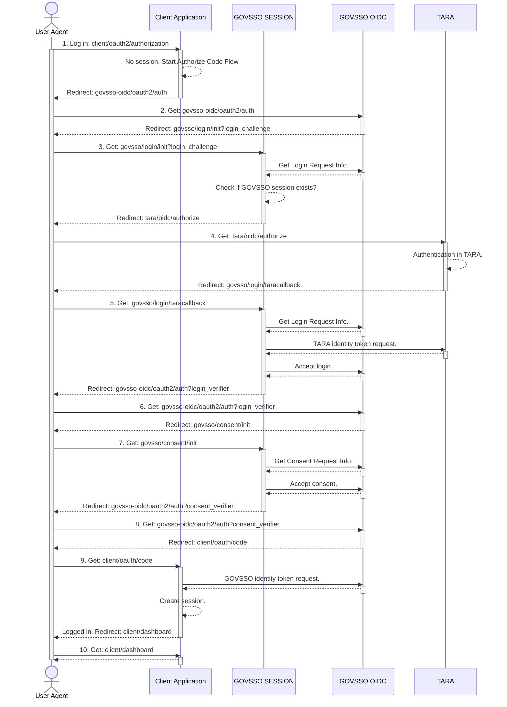
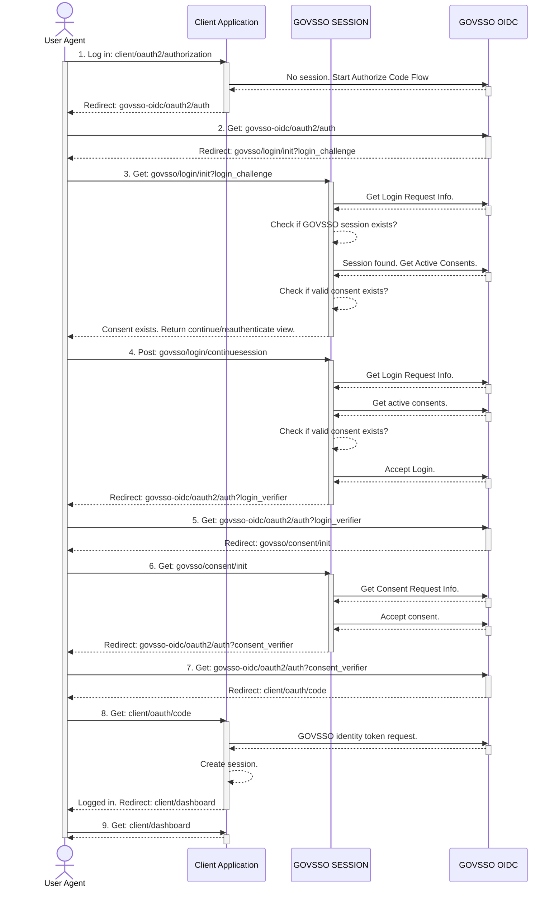
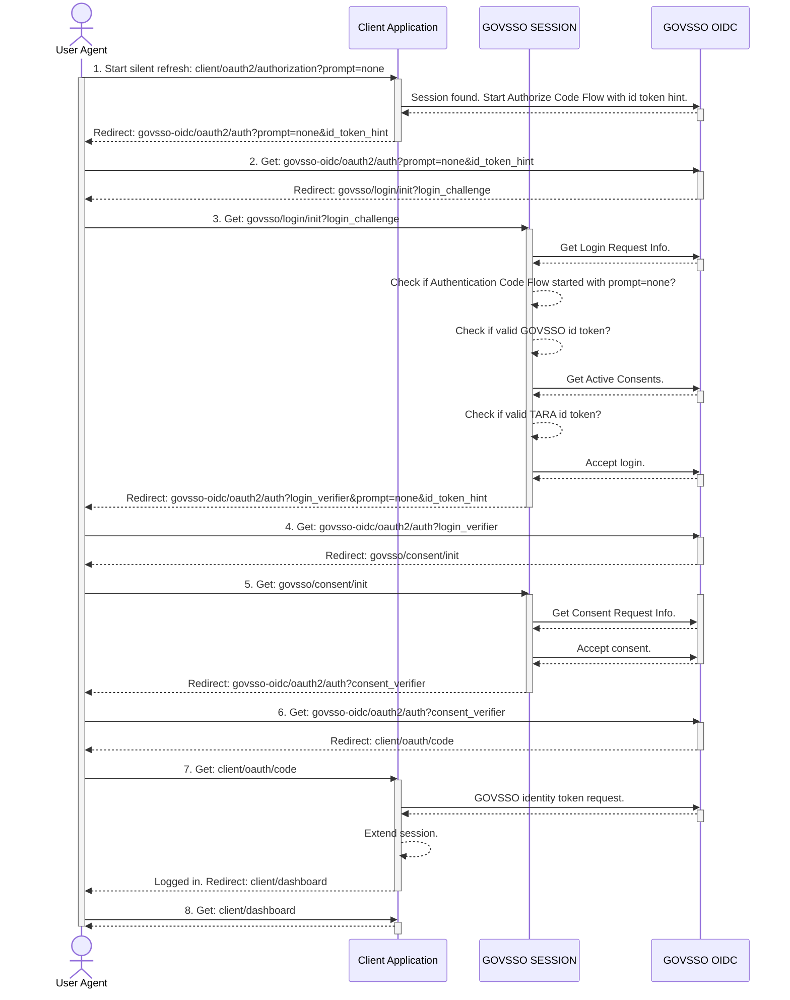
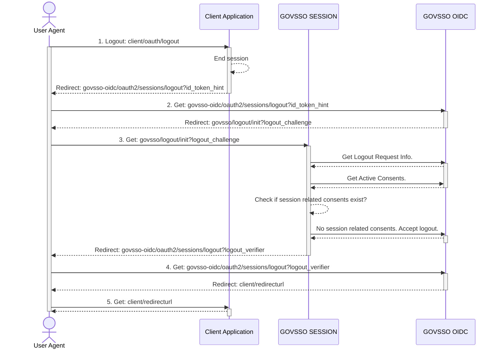
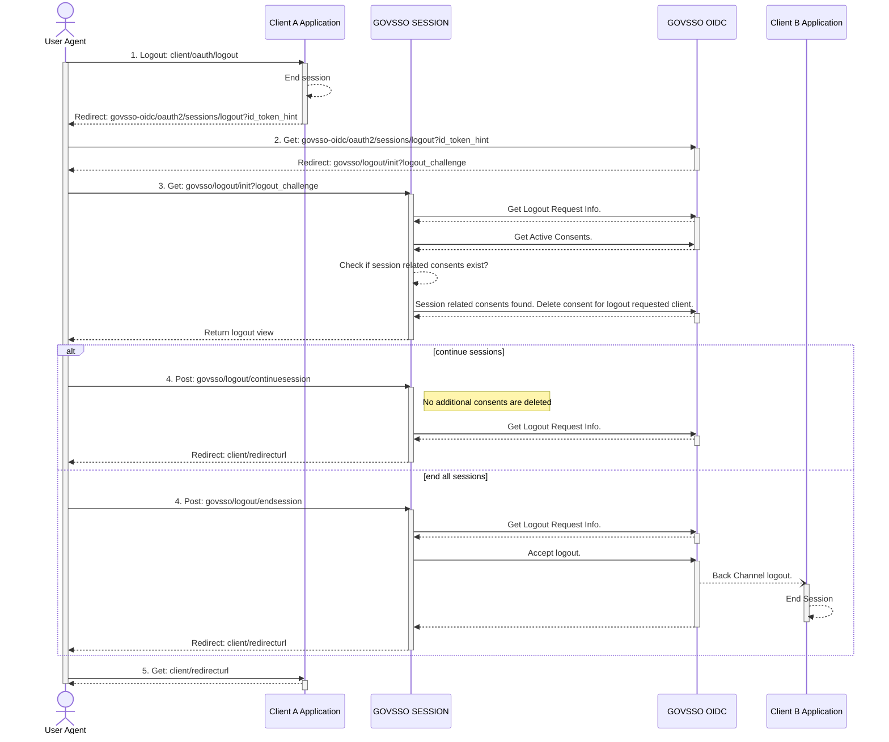
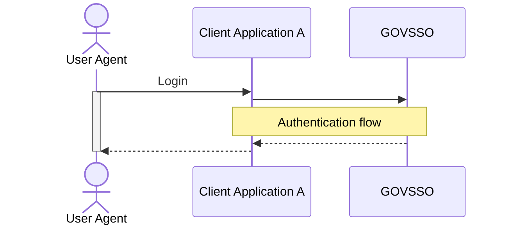
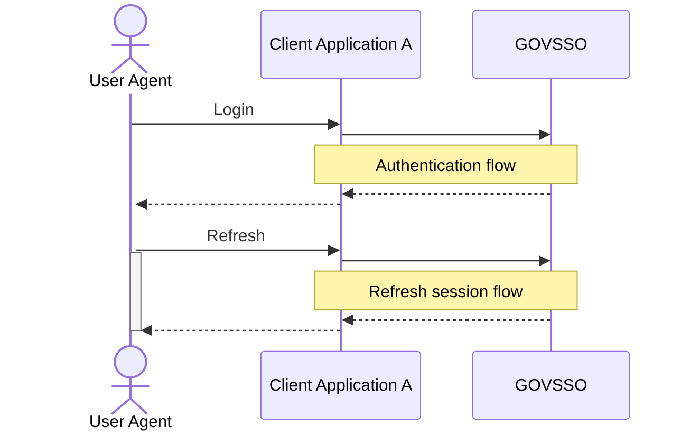
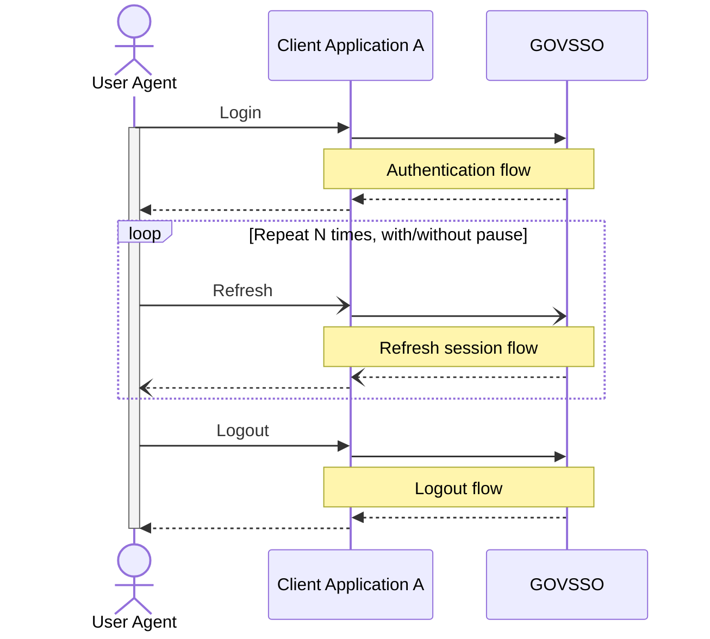
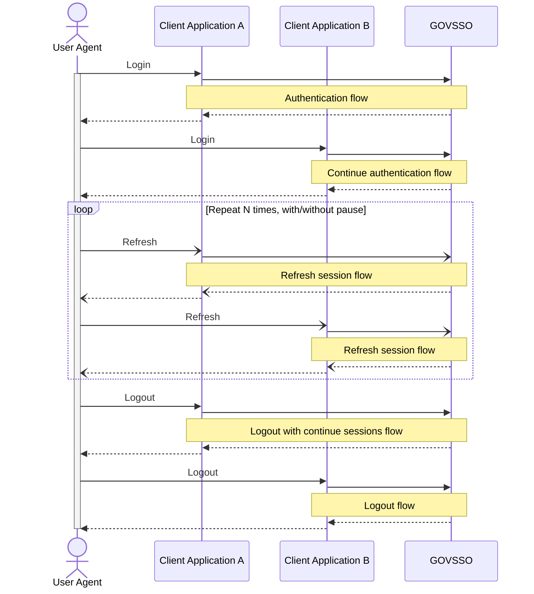

# GOVSSO Performance Tests

Load tests for GOVSSO service (both Ory Hydra and GOVSSO-Session).

## Prerequisites

* Java 17 JDK
* Checkout [GOVSSO-Session](https://github.com/e-gov/GOVSSO-Session) and follow instructions
  in [README.md](https://github.com/e-gov/GOVSSO-Session/blob/master/README.md) to bring up Docker Compose containers
  with required services.
* If reading this in IntelliJ IDEA,
  enable [Mermaid.js support in Markdown files](https://www.jetbrains.com/go/guide/tips/mermaid-js-support-in-markdown/)
  .

## GOVSSO service high level architecture



## Authentication flow



## Continue authentication flow



## Refresh session flow



## Logout flow



## Logout with continue or end all sessions flow



## Common simulation parameters

| Parameter | Mandatory | Default value | Description, example |
| :---------|:----------|:--------------|:---------------------|
| `gatling.simulationClass` | Yes | | Simulation to execute. Example `ee.ria.govsso.perftest.MultiClientSimulation` |
| `injectorProfile` | No | `RAMP_USERS` | Injector profile to execute. Any of `RAMP_USERS, STRESS_RAMP_USERS, STRESS_PEAK_USERS` |
| `clientA` | No | `https://clienta.localhost:11443` | Client A URL. |
| `clientB` | No | `https://clientb.localhost:12443` | Client B URL. |
| `maxSessionTime` | No| `43200` | Maximum session time in seconds that is allowed by GOVSSO-Session service. |
| `sessionRefreshInterval` | No | `780` | Session refresh interval in seconds. |
| `sessionRefreshWithPause` | No | `false` | Simulate session refresh flow with actual pauses between intervals. Example: If `sessionRefreshInterval=15`, `maxSessionTime=12` and `sessionRefreshWithPause=false`, then session refresh flow is performed `N=43200/780=55` times, without pauses in between. |

## Simulation scenarios

### ee.ria.govsso.perftest.SingleClientAuthOnlySimulation



### ee.ria.govsso.perftest.SingleClientAuthAndRefreshSimulation



### ee.ria.govsso.perftest.SingleClientSimulation



### ee.ria.govsso.perftest.MultiClientSimulation



## Injector profiles

Read more about [Injection profiles](https://gatling.io/docs/gatling/reference/current/core/injection/).

This performance test contains some predefined injector profiles to execute scenario.

> TODO: Explain reasoning and add illustrative gatling response time reports.

### RAMP_USERS

Injects users distributed evenly on given duration.

## Simulation parameters

| Parameter | Mandatory | Default value | Description, example |
| :---------|:----------|:--------------|:---------------------|
| `duration` | No | `3600` | Duration of each ramping stage. |
| `rampUsers` | No | `5` | Number of users distributed evenly on given duration. |

```
injectOpen(
    rampUsers(rampUsers).during(ofSeconds(duration)))
)
```

### STRESS_RAMP_USERS

Injects users at a constant rate in stages, defined in users per second, during a given duration. Users will be injected
at randomized intervals.

## Simulation parameters

| Parameter | Mandatory | Default value | Description, example |
| :---------|:----------|:--------------|:---------------------|
| `duration` | No | `3600` | Duration of each ramping stage. |
| `startRampUsers` | No | `0` | Users at start stage. |
| `rampUsers` | No | `5` | Number of users to ramp up at each stage. |
| `maxRampUsers` | No | `30` | Max users at peak stage. |

Example:

- `duration = 120`
- `startRampUsers = 30`
- `rampUsers = 10`
- `maxRampUsers = 60`

Will generate injector profile:

```
injectOpen(
    constantUsersPerSec(30).during(ofSeconds(120)).randomized()
    constantUsersPerSec(40).during(ofSeconds(120)).randomized()
    constantUsersPerSec(50).during(ofSeconds(120)).randomized()
    constantUsersPerSec(60).during(ofSeconds(120)).randomized()
    constantUsersPerSec(50).during(ofSeconds(120)).randomized()
    constantUsersPerSec(40).during(ofSeconds(120)).randomized()
    constantUsersPerSec(30).during(ofSeconds(120)).randomized()
)
```

### STRESS_PEAK_USERS

Injects a given number of users following a smooth approximation of the heaviside step function stretched to a given
duration.

| Parameter | Mandatory | Default value | Description, example |
| :---------|:----------|:--------------|:---------------------|
| `duration` | No | `3600` | Duration of each ramping stage. |
| `peakUsers` | No | `100000` | Number of users distributed evenly on given duration. |

```
injectOpen(
    stressPeakUsers(peakUsers).during(ofSeconds(duration)))
)
```

## Running

With default parameters:

```shell
./mvnw gatling:test -Dgatling.simulationClass=ee.ria.govsso.perftest.MultiClientSimulation
```

With custom parameters:

```shell
./mvnw gatling:test -Dgatling.simulationClass=ee.ria.govsso.perftest.MultiClientSimulation -DclientA=https://clienta.localhost:8443 -DclientB=https://clientb.localhost:9443
```
